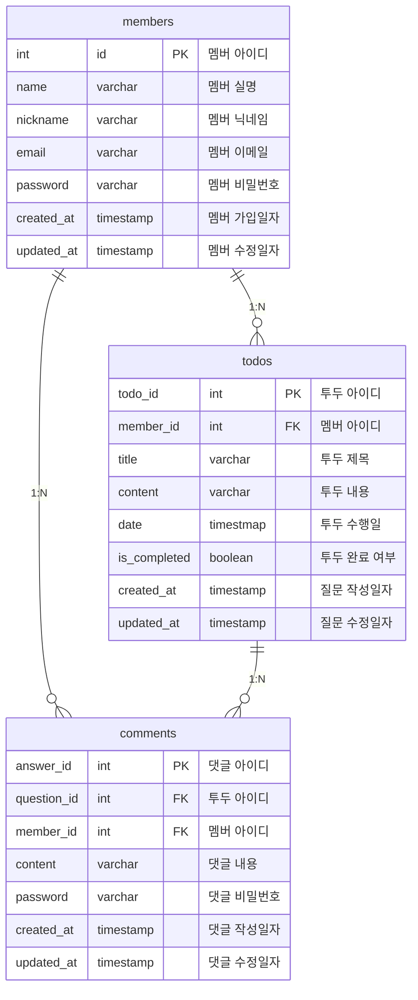

# todo-application

## 개발 일정

`24.01.17` 프로젝트 초기 세팅

`24.01.17` 질문, 답변 도메인에 대한 연관관계 설정 및 기본 API 설계 및 구현

`24.01.18` 멤버 도메인에 대한 연관관계 설정 및 기본 API 설계 및 구현 + 코드 리팩토링

`24.01.19` Spring Security를 적용한 로그인/로그아웃 기능 구현 (현재 진행 중)

`추후 업데이트 예정 사항?` 회원가입 시 넘어오는 Request에 대한 Valdation 로직 구현

## 개발 도구 및 환경


## ERD 설계


## API 설계 (멤버)

|API|Method|URI|Request|Response
|:---:|:---:|:---:|:---:|:---:|
|회원가입|POST|/signup|SignupRequest|201 Created
|로그인|POST|/signin|LoginRequest|201 Created
|로그아웃|GET|/signout||200 Ok
|회원탈퇴|DELETE|/withdrawal/{memberId}|memberId|204 No Content
* SignupRequest : { "name": "string", "email": "string", "nickname": "string", "password": "string" }
* LoginRequest : { "email": "string", "password": "string" }

## API 설계 (Todo)

|API|Method|URI|Request|Response
|:---:|:---:|:---:|:---:|:---:|
|단일 조회|GET|/todos/{todoId}|todoId|200 OK
|전체 조회|GET|/todos||200 OK
|전체 조회 (정렬)|GET|/{sort}?criteria="string"|sort, criteria|200 OK
|추가|POST|/todos|AddTodoRequest|201 Created
|수정|PUT|/todos/{todoId}|todoId, AddTodoRequest|200 OK
|완료 여부 변경|PUT|/todos/convert/{todoId}|todoId|200 OK
|삭제|DELETE|/todos/{todoId}|todoId|204 No Content
* AddTodoRequest : { "memberId": 0, "title": "string", "content": "string", "date": "yyyy:MM:dd HH:mm:ss" }
* sort: ASC/DESC (PathVariable), criteria: 정렬 조건 (RequestParam)
* todoId: 투두 ID (PathVariable)

## API 설계 (Comment)

|API|Method|URI|Request|Response
|:---:|:---:|:---:|:---:|:---:|
|추가|POST|/comments|AddCommentRequest|201 Created
|수정|PUT|/comments/{commentId}|commentId, AddCommentRequest|200 OK
|삭제|DELETE|/comments/{commentId}|commentId, DeleteCommentRequest|204 No Content
* AddCommentRequest : { "memberId": 0, "todoId": 0, "content": "string", "password": "string" }
* DeleteCommentRequest : { "memberId": 0, "todoId": 0, "password": "string" }
* commentId: 댓글 ID (PathVariable)

## 도메인 별 정책

**Members**
- 회원 가입 시, 이메일과 닉네임은 중복 불가능한 고유한 값으로 저장 (미구현)
- 회원 가입 시, 닉네임을 미설정한 회원은 서버 측에서 랜덤하게 닉네임을 생성해서 부여
- 회원 탈퇴 시, 해당 멤버가 등록한 모든 투두와 하위 댓글들까지 삭제 (미구현)
- 회원 탈퇴 시, 해당 멤버가 다른 멤버의 투두에 등록한 댓글은 삭제되지 않음 (미구현)

  (해당 댓글의 작성자명이 '탈퇴한 회원'으로 변경됨)

**Todos**
- 투두 전체 조회 시, 기본 정렬 조건은 '작성일 내림차순'
- 투두 전체 조회 시, 해당 투두 하위의 모든 댓글들까지 출력

  (단, 댓글의 패스워드는 응답으로 넘겨주지 않음)
- 투두 삭제 시, 해당 투두의 하위 댓글들은 모두 삭제
  
**Comments**
- 댓글 수정 및 삭제 시, (댓글 작성한) 멤버의 아이디와 패스워드가 일치해야 작업 수행

## 커밋 컨벤션
```markdown
Feat: 제목 작성 (1줄 이내 작성)
(공백)
공백 이하 본문 작성 (본문 10줄 이내 작성)
- 작업 내용 간단 요약 1
- 작업 내용 간단 요약 2
- 작업 내용 간단 요약 3
- 작업 내용 간단 요약 4
- 작업 내용 간단 요약 5
```

## 
