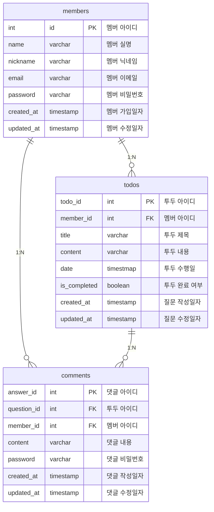

# todo-application

## 개발 일정

`24.01.17` 프로젝트 초기 세팅

`24.01.17` 질문, 답변 도메인에 대한 연관관계 설정 및 기본 API 설계 및 구현

`24.01.18` 멤버 도메인에 대한 연관관계 설정 및 기본 API 설계 및 구현 + 코드 리팩토링

`24.01.19` Spring Security를 적용한 로그인/로그아웃 기능 구현 (현재 진행 중)

`추후 업데이트 예정 사항?` 회원가입 시 넘어오는 Request에 대한 Valdation 로직 구현

## 개발 도구 및 환경
```html
<div align=center> 
<svg role="img" viewBox="0 0 24 24" xmlns="http://www.w3.org/2000/svg"><title>IntelliJ IDEA</title><path d="M0 0v24h24V0zm3.723 3.111h5v1.834h-1.39v6.277h1.39v1.834h-5v-1.834h1.444V4.945H3.723zm11.055 0H17v6.5c0 .612-.055 1.111-.222 1.556-.167.444-.39.777-.723 1.11-.277.279-.666.557-1.11.668a3.933 3.933 0 0 1-1.445.278c-.778 0-1.444-.167-1.944-.445a4.81 4.81 0 0 1-1.279-1.056l1.39-1.555c.277.334.555.555.833.722.277.167.611.278.945.278.389 0 .721-.111 1-.389.221-.278.333-.667.333-1.278zM2.222 19.5h9V21h-9z"/></svg>
<svg role="img" viewBox="0 0 24 24" xmlns="http://www.w3.org/2000/svg"><title>Kotlin</title><path d="M24 24H0V0h24L12 12Z"/></svg>
<svg role="img" viewBox="0 0 24 24" xmlns="http://www.w3.org/2000/svg"><title>Spring Boot</title><path d="m23.693 10.7058-4.73-8.1844c-.4094-.7106-1.4166-1.2942-2.2402-1.2942H7.2725c-.819 0-1.8308.5836-2.2402 1.2942L.307 10.7058c-.4095.7106-.4095 1.873 0 2.5837l4.7252 8.189c.4094.7107 1.4166 1.2943 2.2402 1.2943h9.455c.819 0 1.826-.5836 2.2402-1.2942l4.7252-8.189c.4095-.7107.4095-1.8732 0-2.5838zM10.9763 5.7547c0-.5365.4377-.9742.9742-.9742s.9742.4377.9742.9742v5.8217c0 .5366-.4377.9742-.9742.9742s-.9742-.4376-.9742-.9742zm.9742 12.4294c-3.6427 0-6.6077-2.965-6.6077-6.6077.0047-2.0896.993-4.0521 2.6685-5.304a.8657.8657 0 0 1 1.2142.1788.8657.8657 0 0 1-.1788 1.2143c-2.1602 1.6048-2.612 4.6592-1.0072 6.8194 1.6049 2.1603 4.6593 2.612 6.8195 1.0072 1.2378-.9177 1.9673-2.372 1.9673-3.9157a4.8972 4.8972 0 0 0-1.9861-3.925c-.386-.2824-.466-.8284-.1836-1.2143.2824-.386.8283-.466 1.2143-.1835 1.6895 1.2471 2.6826 3.2238 2.6873 5.3228 0 3.6474-2.965 6.6077-6.6077 6.6077z"/></svg>
<svg role="img" viewBox="0 0 24 24" xmlns="http://www.w3.org/2000/svg"><title>Spring Security</title><path d="M20.59 2.066 11.993 0 3.41 2.066v6.612h4.557a3.804 3.804 0 0 0 0 .954H3.41v3.106C3.41 19.867 11.994 24 11.994 24s8.582-4.133 8.582-11.258V9.635h-4.545a3.616 3.616 0 0 0 0-.954h4.558zM12 12.262h-.006a3.109 3.109 0 1 1 .006 0zm-.006-4.579a.804.804 0 0 0-.37 1.52v.208l.238.237v.159l.159.159v.159l-.14.14.15.246v.159l-.16.189.223.222.246-.246V9.218a.804.804 0 0 0-.346-1.535zm0 .836a.299.299 0 1 1 .298-.299.299.299 0 0 1-.298.3z"/></svg>
<svg role="img" viewBox="0 0 24 24" xmlns="http://www.w3.org/2000/svg"><title>Swagger</title><path d="M12 0C5.383 0 0 5.383 0 12s5.383 12 12 12c6.616 0 12-5.383 12-12S18.616 0 12 0zm0 1.144c5.995 0 10.856 4.86 10.856 10.856 0 5.995-4.86 10.856-10.856 10.856-5.996 0-10.856-4.86-10.856-10.856C1.144 6.004 6.004 1.144 12 1.144zM8.37 5.868a6.707 6.707 0 0 0-.423.005c-.983.056-1.573.517-1.735 1.472-.115.665-.096 1.348-.143 2.017-.013.35-.05.697-.115 1.038-.134.609-.397.798-1.016.83a2.65 2.65 0 0 0-.244.042v1.463c1.126.055 1.278.452 1.37 1.629.033.429-.013.858.015 1.287.018.406.073.808.156 1.2.259 1.075 1.307 1.435 2.575 1.218v-1.283c-.203 0-.383.005-.558 0-.43-.013-.591-.12-.632-.535-.056-.535-.042-1.08-.075-1.62-.064-1.001-.175-1.988-1.153-2.625.503-.37.868-.812.983-1.398.083-.41.134-.821.166-1.237.028-.415-.023-.84.014-1.25.06-.665.102-.937.9-.91.12 0 .235-.017.369-.027v-1.31c-.16 0-.31-.004-.454-.006zm7.593.009a4.247 4.247 0 0 0-.813.06v1.274c.245 0 .434 0 .623.005.328.004.577.13.61.494.032.332.031.669.064 1.006.065.669.101 1.347.217 2.007.102.544.475.95.941 1.283-.817.549-1.057 1.333-1.098 2.215-.023.604-.037 1.213-.069 1.822-.028.554-.222.734-.78.748-.157.004-.31.018-.484.028v1.305c.327 0 .627.019.927 0 .932-.055 1.495-.507 1.68-1.412.078-.498.124-1 .138-1.504.032-.461.028-.927.074-1.384.069-.715.397-1.01 1.112-1.057a.972.972 0 0 0 .199-.046v-1.463c-.12-.014-.204-.027-.291-.032-.536-.023-.804-.203-.937-.71a5.146 5.146 0 0 1-.152-.993c-.037-.618-.033-1.241-.074-1.86-.08-1.192-.794-1.753-1.887-1.786zm-6.89 5.28a.844.844 0 0 0-.083 1.684h.055a.83.83 0 0 0 .877-.78v-.046a.845.845 0 0 0-.83-.858zm2.911 0a.808.808 0 0 0-.834.78c0 .027 0 .05.004.078 0 .503.342.826.859.826.507 0 .826-.332.826-.853-.005-.503-.342-.836-.855-.831zm2.963 0a.861.861 0 0 0-.876.835c0 .47.378.849.849.849h.009c.425.074.853-.337.881-.83.023-.457-.392-.854-.863-.854z"/></svg>
</div>
```

## ERD 설계


## API 설계 (멤버)

|API|Method|URI|Request|Response
|:---:|:---:|:---:|:---:|:---:|
|회원가입|POST|/signup|SignupRequest|201 Created
|로그인|POST|/signin|LoginRequest|201 Created
|로그아웃|GET|/signout||200 Ok
|회원탈퇴|DELETE|/withdrawal/{memberId}|memberId|204 No Content
* SignupRequest : { "name": "string", "email": "string", "nickname": "string", "password": "string" }
* LoginRequest : { "email": "string", "password": "string" }

## API 설계 (Todo)

|API|Method|URI|Request|Response
|:---:|:---:|:---:|:---:|:---:|
|단일 조회|GET|/todos/{todoId}|todoId|200 OK
|전체 조회|GET|/todos||200 OK
|전체 조회 (정렬)|GET|/{sort}?criteria="string"|sort, criteria|200 OK
|추가|POST|/todos|AddTodoRequest|201 Created
|수정|PUT|/todos/{todoId}|todoId, AddTodoRequest|200 OK
|완료 여부 변경|PUT|/todos/convert/{todoId}|todoId|200 OK
|삭제|DELETE|/todos/{todoId}|todoId|204 No Content
* AddTodoRequest : { "memberId": 0, "title": "string", "content": "string", "date": "yyyy:MM:dd HH:mm:ss" }
* sort: ASC/DESC (PathVariable), criteria: 정렬 조건 (RequestParam)
* todoId: 투두 ID (PathVariable)

## API 설계 (Comment)

|API|Method|URI|Request|Response
|:---:|:---:|:---:|:---:|:---:|
|추가|POST|/comments|AddCommentRequest|201 Created
|수정|PUT|/comments/{commentId}|commentId, AddCommentRequest|200 OK
|삭제|DELETE|/comments/{commentId}|commentId, DeleteCommentRequest|204 No Content
* AddCommentRequest : { "memberId": 0, "todoId": 0, "content": "string", "password": "string" }
* DeleteCommentRequest : { "memberId": 0, "todoId": 0, "password": "string" }
* commentId: 댓글 ID (PathVariable)

## 도메인 별 정책

**Members**
- 회원 가입 시, 이메일과 닉네임은 중복 불가능한 고유한 값으로 저장 (미구현)
- 회원 가입 시, 닉네임을 미설정한 회원은 서버 측에서 랜덤하게 닉네임을 생성해서 부여
- 회원 탈퇴 시, 해당 멤버가 등록한 모든 투두와 하위 댓글들까지 삭제 (미구현)
- 회원 탈퇴 시, 해당 멤버가 다른 멤버의 투두에 등록한 댓글은 삭제되지 않음 (미구현)

  (해당 댓글의 작성자명이 '탈퇴한 회원'으로 변경됨)

**Todos**
- 투두 전체 조회 시, 기본 정렬 조건은 '작성일 내림차순'
- 투두 전체 조회 시, 해당 투두 하위의 모든 댓글들까지 출력

  (단, 댓글의 패스워드는 응답으로 넘겨주지 않음)
- 투두 삭제 시, 해당 투두의 하위 댓글들은 모두 삭제
  
**Comments**
- 댓글 수정 및 삭제 시, (댓글 작성한) 멤버의 아이디와 패스워드가 일치해야 작업 수행

## 커밋 컨벤션
```markdown
Feat: 제목 작성 (1줄 이내 작성)
(공백)
공백 이하 본문 작성 (본문 10줄 이내 작성)
- 작업 내용 간단 요약 1
- 작업 내용 간단 요약 2
- 작업 내용 간단 요약 3
- 작업 내용 간단 요약 4
- 작업 내용 간단 요약 5
```

## 
